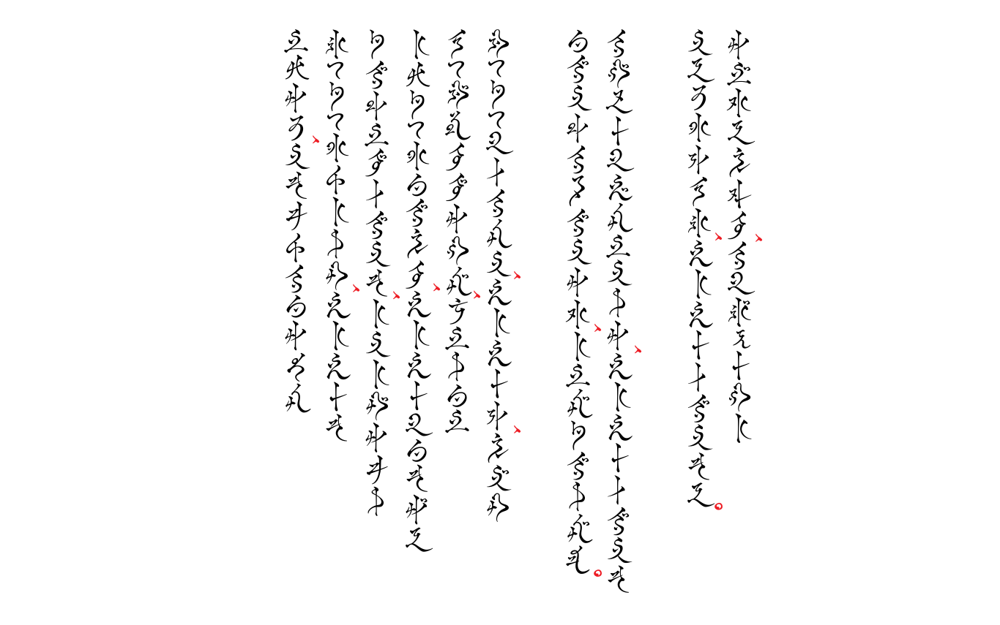

# Augmented Far Eastern Script
[简介](README_CN.md) | [紹介](README_JP.md) * Japanese introduction page doesn't exist yet, your help in translation is deeply appreciated.

**Fanmade** typeface, greetings from Kugane.

> Reads 「ようこそ　クガネへ」, can be found on _Shiokaze_ Hostelry.

### Localized Family Name
- 🇺🇸 Augmented Far Eastern Script
- 🇯🇵 クガネモジＲＥ
- 🇨🇳 改良型东方文字

## Glyphs Preview

> Excerpt from lyrics of [_Wayward Daughter (月下彼岸花 ～蛮神ツクヨミ討滅戦～)_](https://jp.finalfantasyxiv.com/blog/002393.html)

Currently supports:
- Hiragana/Katakana (identical)
- Numbers (0-9) (full-width/tabular figures)
- Basic punctuations (personal design)
- and more (…?)

By default, this typeface features proportional glyphs in both horizontal and vertical typesetting. Due to the scripture design, it is highly recommended to use vertical typesetting. Most glyphs in this typeface have `vert` alternatives. 

## Opentype Features Support

Below are the currently supported Opentype features. 

### Standard Ligature `liga` (default on)

There's a set of ligatures that looks like double vowels kana in the official glyph table. I'm still not sure about how it is supposed to be used but here we go.

> Note that not all double vowels are supposed to be combined, based on the meanings of the phrase. Therefore, please be cautious as in most popular design software, `liga` is on by default. I chose to use this feature table to differentiate from the `dlig` below.

Also features ligatures between `!` & `?`.

### Discretionary Ligature `dlig` (default off)

The official glyph table includes a few kana ligatures (合略仮名): some traditional ones, such as `より→ゟ` and `コト→ヿ`, as well as some related to the lore in the game, such as さぶらい, ドマ, etc.

### Full-width `fwid` (default off)

By toggle this on, all kana in horizontal typesetting will be substituted with full-width alternatives. This is **NOT** recommended for use.
> In the source file, these are actually the original glyphs traced from the official glyph table. So basically, these are just the backup for current glyphs and serve as ref for font development.

### Vertical support `vert`, `vkna`, `vrt2` (automatic)

> Excerpt from lyrics of [_Sunrise (千年の暁 ～朱雀征魂戦～)_](https://jp.finalfantasyxiv.com/blog/002537.html)

These features should be automatically applied when using a modern design software.

### Stylistic Alternates `salt` (default off)

Currently only features a different (personal) design of full-width brackets `【】`, with vertical support.

### Stylistic Set 1 `ss01`: Alternative vertical punctuation layout form (default off)

A personal attempt to implement an alternative layout of vertical punctuation (直排行间标点). This style of punctuation application may be seen in antique Chinese books. Will move `、，。` to the side, i.e. between the rows. (colored in red in [vertical support preview](#vertical-support-vert-vkna-vrt2-automatic))

### Stylistic Set 2 `ss02`: Center-align vertical sutegana (default off)

Personally I feel that the sutegana in this specific typeface could be center-aligned in vertical typesetting, based on its handwriting style of the scripture.

## Reference

- _Far Eastern Script_ from [_Encyclopaedia Eorzea II_](https://sqex.to/giPAn)
- Development inspired by [_Kazuraki_ by Ryoko Nishizuka 西塚涼子](https://fonts.adobe.com/fonts/kazuraki-sp2n)

## Notice

Original design from [FINAL FANTASY XIV by SQUARE ENIX CO., LTD.](https://www.finalfantasyxiv.com/) Please do not use this fanmade font for any type of commercial use.

## Footnote

Please feel free to post any issues and/or suggestions here.