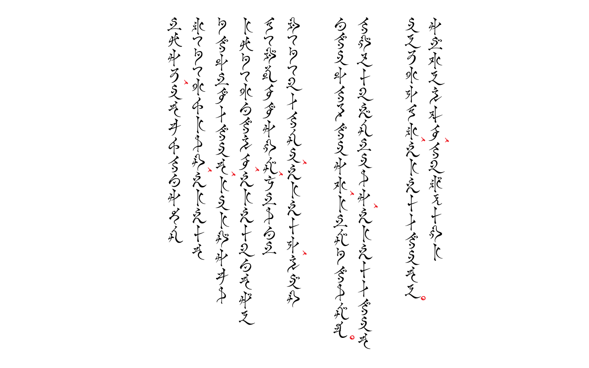

# 改良型东方文字

[Introduction](README.md) | [紹介](README_JP.md)
> 暂无日文介绍，欢迎协助！

**非官方自制**字体，欢迎来到黄金港！

改良型东方文字进行了再设计，增加了更多字符与 Opentype 特性。

> 写作 「ようこそ　クガネへ」，可以在潮风亭的牌匾上看到。

### 本地化字体名
- 🇺🇸 Augmented Far Eastern Script
- 🇯🇵 クガネモジＲＥ
- 🇨🇳 改良型东方文字

## Windows 兼容性

参见 [Issue](https://github.com/karaipsum/Postulated-Proto-Alphabet/issues/1#issue-2312178558)

太长不看：如果在 Windows 下无法打开或安装字体，请使用前缀有 [W] 的字体文件。

## 字符预览

> 引自 [《彼岸花开 (月下彼岸花 ～蛮神ツクヨミ討滅戦～)》](https://jp.finalfantasyxiv.com/blog/002393.html) 的歌词。

当前支持：
- 平假名/片假名 （字符相同）
- 数字（0~9）（全宽/半宽/`tnum`）
- 标点符号（个人设计）
- 以及……？

默认设置下，字体在横排下不等宽、竖排下不等高，均为比例字符设计。
由于字形为书法风格，强烈建议使用竖排进行排版。
本字体的大多数字符均支持竖排 `vert` 特性。

## Opentype 特性支持

以下是当前支持的 Opentype 特性。

### 标准连字 `liga`（默认开启）
目前支持 `！` 和 `？` 的两两连字组合，以及不中断的破折号`——`。

### 自由连字 `dlig`（默认关闭）

官方字符表中还包含了一部分合略假名（合略仮名）。一部分是日语中本来就有的，例如 `より→ゟ` 和 `コト→ヿ`；还有一部分与游戏中的民俗文化有关，例如 さぶらい 和 ドマ。

### 花饰字 `swsh`（默认关闭）

官方字符表中有像是双元音组合的连写假名，`あいうえお` 两两组合共 25 个。虽然不知道具体用法不过还是做出来了。

> 请注意：根据词义句意，并不是所有双元音的组合都应该连写。**在1.001版本更新中**，双元音的组合字已经更换为花饰字 `swsh` 开启，以避免因标准连字 `liga` 默认开启造成的转换错误。

### 全宽 `fwid`（默认关闭）

开启后，所有横排假名会变为全宽形式（统一 800 字宽）。本特性**不**推荐开启。
> 在源文件中，这批假名其实是最先被制作出来的，在官方字符表中描摹而成。在之后字体的开发中，以此作为变宽、变高等替换字符的引用来源。~~为了不浪费所以把这批字形还是做成特性了。~~

### 竖排特性支持 `vert`, `vkna`, `vrt2`（自动）

> 引自 [《千年旭光 (千年の暁 ～朱雀征魂戦～)》](https://jp.finalfantasyxiv.com/blog/002537.html) 的歌词。

多数现代设计排版软件在竖排输入时会默认自动应用竖排特性。

红色标点采用了[样式集 1 `ss01`：用于竖排的行间标点样式](#样式集-1-ss01-用于竖排的行间标点样式默认关闭)。

### 样式替代 `salt`（默认关闭）

目前仅包含一组替代样式的方括号 `【】`，且支持竖排特性。

### 样式集 1 `ss01`：用于竖排的行间标点样式（默认关闭）

在部分中文古籍中会有的行间标点，也即句读符号移至行间的排版风格。竖排输入时开启 `ss01` 后会将 `、，。` 替换为高度为0的行间标点。在[竖排特性支持](#竖排特性支持-vert-vkna-vrt2自动)附图处可以看到红色标点样式。

### 样式集 2 `ss02`：竖排居中对齐小写假名（默认关闭）

个人觉得这种风格的字体在竖排时，小写假名可以居中对齐，很多假名都有一条中轴线，个人感觉是倾向居中对齐的，所以做了这个替换样式集。

## 参考与来源

- 东方文字字符表 [_Encyclopaedia Eorzea II_](https://sqex.to/giPAn) | [《艾欧泽亚百科全书II》](https://www.taobao.com/list/item/635215701689.htm)
- 字体的制作受到了 [かづらき by Ryoko Nishizuka 西塚涼子](https://fonts.adobe.com/fonts/kazuraki-sp2n) 的启发

## 授权

此处提及的所有公司、产品和系统名称均为其各自公司的商标或注册商标。

改良型东方文字以 [MIT](LICENSE) License 开源。

## 尾声

欢迎在 Issues 里提出错误或建议。